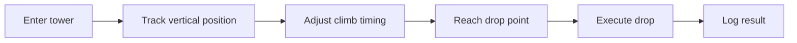

# lucky-block-climb-script

*A standalone climb-and-drop routine for Lucky Block runs, built for players who want consistent placement without babysitting every jump.*

## What this is

lucky-block-climb-script is not a game mod, not a Roblox client replacement, and not a general-purpose automation suite. It does one thing: it automates the climb sequence used in Lucky Block obstacle towers and handles the drop timing once the top is reached, so the block lands where you intended instead of skidding off an edge.

The script watches your character's vertical progress through a Lucky Block tower, adjusts input timing as you climb, and executes the drop at the point you've configured. It's built for the specific rhythm of Lucky Block towers — narrow ledges, moving platforms, and a drop window that's easy to miss on manual input. Nothing here touches game files or server data; it reads and reacts to on-screen state only.

  

The button above opens the project's landing page, where the current build is available to download.

## Who it is for

- Lucky Block tower players who keep missing the drop window on tall or moving-platform sections.
- Streamers who want a smoother, less repetitive climb phase during long sessions.
- Players testing multiple Lucky Block seeds who need repeatable climb timing to compare results.
- Server moderators who want to understand how climb-assist tools behave before setting server rules.

## What you can do

- **Automate the climb sequence** through standard Lucky Block tower layouts, including narrow ledges and staggered platforms.
- **Set a custom drop point** so the block releases exactly where your run calls for it, not wherever momentum takes you.
- **Adjust climb speed** to match ping, frame rate, or a specific tower's platform spacing.
- **Pause and resume mid-climb** without losing your position tracking.
- **Run on a simple hotkey** so you're never digging through menus mid-session.
- **Review a run log** after each climb to see timing and drop accuracy.
- **Reset between attempts** in one action, useful when testing different seeds back to back.
- **Keep a lightweight footprint** — no background services once you close it.

## Getting started

1. Open the landing page using the download button on this page.
2. Download the current build for Windows.
3. Extract the folder to any location on your drive.
4. Run the executable — no installation wizard, no admin prompt required.
5. Set your drop point and climb speed, then start the script before entering a tower.

## Requirements

| OS | RAM | Disk |
|---|---|---|
| Windows 10 (64-bit) | 4 GB minimum | 150 MB free |
| Windows 11 (64-bit) | 8 GB recommended | 300 MB free (with logs enabled) |

The script is a standalone executable. No toolchain, runtime installer, or build step is needed — download, extract, run.

## How it works

1. The script reads your character's on-screen vertical position as you enter a tower.
2. It tracks each platform transition and adjusts input timing to keep the climb smooth.
3. Once you reach the configured drop point, it triggers the drop input at the right frame.
4. It logs the climb duration and drop accuracy for that attempt.
5. On reset, it clears the tracked state so the next attempt starts clean.

## FAQ

**Does this work on every Lucky Block tower layout?**
It's tuned for standard vertical towers with ledges and platforms. Towers with heavy randomization or unusual physics may need manual speed adjustments.

**Will this get me banned from a server?**
That depends entirely on the server's own rules around automation tools. Read the ruleset for any server you play on before using this.

**Can I use this on Mac or Linux?**
No. The current build targets Windows 10 and 11 only.

**Does it modify game files?**
No. It only reads on-screen state and sends timed inputs — it does not touch game files or server data.

**Why does my drop point keep missing by a few frames?**
Frame rate drops or high ping can shift timing slightly. Lowering climb speed usually corrects this.

## Troubleshooting

- **Script doesn't detect the climb:** Confirm the game window is focused and not minimized when you start the script.
- **Drop happens too early or late:** Recalibrate your drop point setting and lower climb speed by one step.
- **Executable won't launch:** Extract the full folder first — running it directly from a zip archive will fail.
- **Run log is empty after a session:** Check that logging is enabled in settings before starting the climb.

## License

Released under the [MIT License](LICENSE). This project is provided as-is, with no warranty of fitness for a particular server or game version. Use is at your own discretion and subject to the rules of whatever game or server you play on.

  

